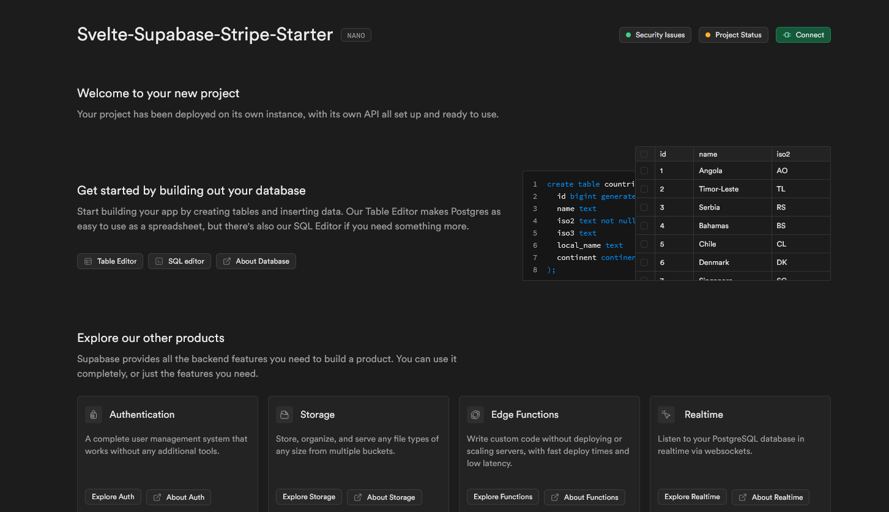

# Svelte Supabase Stripe Starter

A modern full-stack starter template combining Svelte, Supabase, and Stripe for rapid web application development. This template provides authentication, payment processing, and a responsive UI out of the box. Based on 

## Features

- ⚡ **Svelte & SvelteKit** - Reactive UI framework with built-in routing
- 🗄️ **Supabase Integration** - Authentication and real-time database
- 💳 **Stripe Integration** - Payment processing setup
- 🎨 **TailwindCSS** - Utility-first styling
- 🔒 **Auth Flows** - Pre-built sign-in, sign-up, and password reset
- 📱 **Responsive Design** - Mobile-friendly interface

## Architecture


## Setup Instructions

### Clone Repository

Clone the repository and change into the new directory:
```bash
git https://github.com/gSUz92nc/Svelte-Supabase-Stripe-Starter
cd Svelte-Supabase-Stripe-Starter
```

### Install dependencies:

Next install all the required packages using npm or whatever package manager you'd like to use.

```bash
npm install
```

### Create .env.local

Copy everything from the .env.template to a .env.local file. Don't worry about populating it yet.

```bash
cp .env.template .env.local
```

### Setup Supabase

Create a new Supabase Project at [database.new](https://database.new) which should open to something like this:


Just fill in all the necessary info and don't worry about any additional settings. After filling in the information hit "Create new project" and wait for the setup to complete which is indicated by the spinner next to your project name


After it has been setup you should see something like this:


## Building

To create a production version of your app:

```bash
npm run build
```

You can preview the production build with `npm run preview`.

> To deploy your app, you may need to install an [adapter](https://svelte.dev/docs/kit/adapters) for your target environment.

## Credits
This project is heavily inspired by the [Next.js Subscription Starter](https://github.com/vercel/nextjs-subscription-payments) by Vercel

## Things to do

- Change project id in `package.json`
- Update Site URL on supabase
- Add redirect URL '/auth/update-password' on supabase
- Possibly cascade delete on supabase
- Update Auth templates: Go to the Auth templates page in your dashboard. In the Confirm signup template, change {{ .ConfirmationURL }} to {{ .SiteURL }}/auth/confirm?token_hash={{ .TokenHash }}&type=email.
- Outlook safelinks messes up auth links. ¯\_(ツ)_/¯