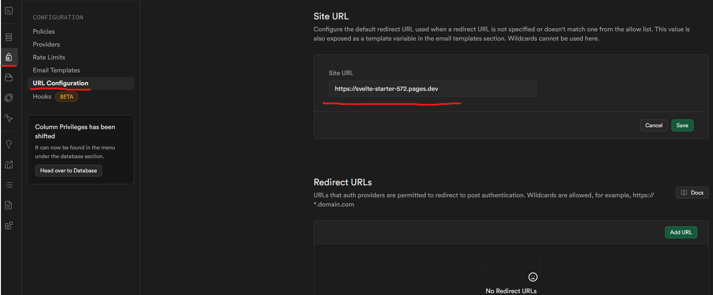
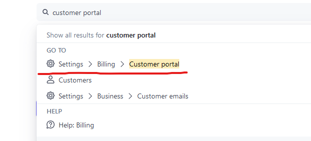
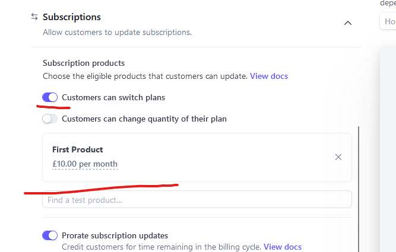

# Svelte Supabase Stripe Starter

A modern full-stack starter template combining Svelte, Supabase, and Stripe for rapid web application development. This template provides authentication, payment processing, and a responsive UI out of the box.

## Features

- ⚡ **Svelte & SvelteKit** - Reactive UI framework with built-in routing
- 🗄️ **Supabase Integration** - Authentication and real-time database
- 💳 **Stripe Integration** - Payment processing setup for subscriptions
- 🎨 **TailwindCSS** - Utility-first styling
- 🔒 **Auth Flows** - Pre-built sign-in, sign-up, and password reset
- 📱 **Responsive Design** - Mobile-friendly interface

## Architecture


## Setup Instructions

### Clone Repository

Clone the repository and change into the new directory:

```bash
git https://github.com/gSUz92nc/Svelte-Supabase-Stripe-Starter
cd Svelte-Supabase-Stripe-Starter
```

### Install dependencies:

Next install all the required packages using npm or whatever package manager you'd like to use.

```bash
npm install
```

### Create .env.local

Copy everything from the .env.template to a .env.local file. Don't worry about populating it yet.

```bash
cp .env.template .env.local
```

### Setup Supabase

Create a new Supabase Project at [database.new](https://database.new) which should open to something like this:


Just fill in all the necessary info and don't worry about any additional settings. After filling in the information hit "Create new project" and wait for the setup to complete which is indicated by the spinner next to your project name


After it has been setup you should see something like this:


Now that your project is setup we need to add our Supabase API keys to our .env.local.

On the left of the supabase dashboard there is a "Project API" button which will open a drawer with your project keys.

_Make sure to select the "Connect" tab on the left_


Now copy the keys using the "Copy" button and then replace the placeholder values in your .env.local file.

- PUBLIC_SUPABASE_URL -> Project URL
- PUBLIC_SUPABASE_ANON_KEY -> Client API key
- SUPABASE_SERVICE_ROLE_KEY -> Service key

_Note: Supabase has recently announced that they plan to change the current api key system. [Click here for info.](https://github.com/orgs/supabase/discussions/29260)_

Your .env.local file should look like this:


Next we need to setup our database schema since Supabase uses PostgreSQL which is a relational database. All you have to do is copy everything in '/setup/supabase-schema.sql' into the sql editor on the supabase dashboard (found on the right navbar) and press "Run"


It will come up with a warning saying the "Query has destructive operation". Acknowledge this and hit "Run this query"


It should say "Success. No rows returned" at the bottom.


If you now go to the table editor using the left navbar you should see your 5 tables from the schema and if you click on any of them they should have all their columns setup as well as [Row-Level Security](https://supabase.com/docs/guides/database/postgres/row-level-security) which is what we use to limit what data users can access from each table.

### Setup Stripe

Create a Stripe account at [https://stripe.com](https://stripe.com)

Once you have verified your email click on "Explore features" then click the "x" at the top left


You should now be greeted by your Stripe dashboard:


Next we want to get our Stripe keys, you may find them on the dashboard as "Publishable key" and "Secret key". If you don't press "CTRL + K" or click on the search bar at the top, type "key" and click on "Developers > API keys"


Now all that's left is to copy the keys into your .env.local file

- STRIPE_SECRET_KEY -> Secret key
- PUBLIC_STRIPE_PUBLISHABLE_KEY -> Publishable key

_Leave the STRIPE_WEBHOOK_SECRET for now_

### Getting a URL

After setting up your Stripe account we need to get a public URL for our website, this is so Stripe has somewhere to send their webhooks when creating products on Stripe so our database is synced up with Stripe.

There are a few platforms that support SvelteKit and a few are listed below with tutorials of how to setup a project with their platform

- [Cloudflare](https://developers.cloudflare.com/pages/framework-guides/deploy-a-svelte-site/) (Personally recommend and is what I use)
- [Vercel](https://vercel.com/docs/frameworks/sveltekit)
- [Netlify](https://docs.netlify.com/frameworks/sveltekit/)

_All platforms offer a free tier to get started_

Your build will probably **NOT** build right away since we are still missing the "PUBLIC_SITE_URL" and "STRIPE_WEBHOOK_SECRET". For now just put in a placeholder string so our build can complete and we get a URL.

Hopefully after doing this you will get a public site URL which we will use for setting up Stripe webhooks. Make a note of what the url is. In my case it would be "https://svelte-starter-572.pages.dev"


_Make sure not to copy your deployment url which may only point to that specific deployment and not future ones. It generally has a code infront of the actual site URL_

You can now update your .env.local with your new site URL and update your environment variable on your hosting service.

- PUBLIC_SITE_URL -> "Your site URL"

### Setting Up Auth Emails

To actually get authentication emails setup we need to update the links in the email templates. First navigate to the email templates section on the Supabase dashboard.


Once there all you need to do is copy these templates into their respective sections.

#### Confirm signup

```html
<h2>Confirm your signup</h2>

<p>Welcome! Please click the button below to confirm your account:</p>

<a
	href="{{ .SiteURL }}/auth/confirm-signup?confirmation_url={{ urlquery .SiteURL }}/auth/confirm?token_hash={{ .TokenHash }}&type=signup"
>
	Confirm your account
</a>

<p>If you didn't create this account, you can safely ignore this email.</p>
```

#### Reset Password

```html
<h2>Reset Your Password</h2>

<p>Click the button below to reset your password:</p>

<a
	href="{{ .SiteURL }}/auth/confirm-reset?confirmation_url={{ urlquery .SiteURL }}/auth/confirm?token_hash={{ .TokenHash }}"
>
	Reset Password
</a>

<p>If you didn't request a password reset, you can safely ignore this email.</p>
```

_You can change the text in each of these emails just make sure that the anchor tag's href is unchanged_

#### Adding your Site URL

Finally using the left navbar click on "URL Configuration" and then enter your site URL you got earlier. Make sure there is no trailing "/" so your site URL looks like: "https://example.com" not "https://example.com/"



**WARNING**: While using the built-in email service emails will only be sent out to those who are in your Supabase organisation so if you plan to go into a more public environment you probably want to eventually setup your own SMTP service. For more info you can check out [this discussion](https://github.com/orgs/supabase/discussions/29370)

### Stripe Webhooks

To set up the webhooks go back to your Stripe dashboard and press "CTRL + K" or click the search bar and type in "event destination" and click on "Create an event destination"


This will open the workbench where we will enter all the events we want to broadcast to our webhooks endpoint.

_You may also want to update the apiVersion and appInfo in ./src/lib/utils/stripe/config.ts with the current api version and your app info_

Next select of these events by searching for them:

- product.created
- product.updated
- product.deleted
- price.created
- price.updated
- price.deleted
- checkout.session.completed
- customer.subscription.created
- customer.subscription.updated
- customer.subscription.deleted

which should look like this:


Then press continue. Select the "Webhook endpoint" destination type and then press continue again. Now type in your site URL into the "Endpoint URL" input and then at the end add "/api/webhooks" so that your Endpoint URL is in the format: "https://example.com/api/webhooks". Mine would look like:


Then press "Create Endpoint" which should open your event destination in the workbench. Copy your "Signing secret" from the right hand side and paste that into your .env.local file under "STRIPE_WEBHOOK_SECRET" as well as update the environment variable on your hosting platform.


- STRIPE_WEBHOOK_SECRET -> Signing Secret

Now rebuild your website after updating the variables and then once it has finished and succeeded your project should be fully set up.

### Create a Subscription

This template only supports subscriptions so let's go over how to create one.

Go to your Stripe dashboard and the on the left click "Product catalogue", then "Create product"


Next full in the data making sure that it is a "recurring" product and then click "Add product". Then go back to your Supabase project and make sure that it did get added.


and if you go to your site, create an account and then go to '/products' you should see your added product!

### Customer Billing Portal

To let your customers manage their subscription we need to configure a few settings on the Stripe dashboard. Once on the dashboard press "CTRL + K" or click the search bar at the top to open it. Once the search bar is open type "Customer portal" and then click on the "Customer portal option"



Under  "Subscriptions" tick "Customers can switch plans" so that your users can switch plans and then add the plans they can switch to right under that.



Feel free to configure everything here to what suites your use case. However I recommend not changing any values that are on by default. Don't forget to press "Save changes" at the top right when you are done.

## Post Setup

I'd recommend testing everything works as expected after setting everything up. For convenience I'd check everything in this order:

- Stripe subscriptions can be created on the dashboard and appear in the Supabase table editor after creating
- Your website is accessible
- You can create an account (you get a confirmation email + Account email is confirmed on Supabase dashboard)
- You can access "/home" after signing in
- Delete your cookies for the site and then attempt login
- Delete your cookies again and make sure the forgot password flow works
- Test updating/archiving/deleting (never used subscriptions) works and changes are reflected on the Supabase table editor
- Navigate to the products page and buy subscription (use Stripe's test card 4242 4242 4242 4242, 12/34, 424, any name + address)
- Make sure the subscription is shown in the Supabase table editor
- Test the customer portal works by navigating to "/account/manage" and make sure changes are reflected on Stripe and Supabase

- And anything else I forgot to add that your user might do.

*Remember to setup your Stripe business profile before going into production*

## Helpful Tools

### Generate Database Types

The base database types following those generated in the "setup/supabase-schema.sql" are saved in "src/lib/types_db.ts". If you make any changes to the database schema you can regenerate these types by running the following command:

```bash
npm run generate:types
```

or whatever package manager you are using.

Just make sure to edit the command in package.json to have your Supabase project ID. If you haven't logged in to Supabase CLI you can do so by running:

```bash
npx supabase login
```

And then follow the instructions.

### Package Scripts

I'd recommend looking at the package.json file to see all the scripts that are available to you. They all do what they say on the tin so I won't go over them here.

## Credits

This project is heavily inspired by the [Next.js Subscription Starter](https://github.com/vercel/nextjs-subscription-payments) by Vercel, which I only found out about because of [this](https://www.youtube.com/watch?v=I7CFD99sp1g) video by Supabase.